## First Documentation of Results with my Pipeline

### Planned steps for this Project

- Here i tried to reproduce the Results from the PeptideBERT Paper. I used the same Data and the same Hyperparameters as in the Paper. 
- I Still need to tweek the MLM train with stuff like Curriculum Learning. There is still lot of optimization to do.

- [x] **Step 1:** Show Results of PeptideBERT Train with normal whitelab data
  - [x] **Step 1.1:** Show ablation Test Results
  - [ ] **Step 1.2:** TODO Cluster with model
- [x] **Step 2:** Show Results of PeptideBERT Train without Data Leakage
- [x] **Step 3:** Show Results of PeptideBERT Train with our Data and w/o Leakage
  - [ ] **Step 3.1:** TODO Cluster with model
- [ ] **Step 4:** Show Results of MLMPeptideBERT and compare to protBERT
  - [ ] **Step 4.1:** Initial Accuracy of mlm task train should be accuracy of protBERT for our peptide Task
  - [ ] **Step 4.2:** Show Results with Curriculum Learning
-[ ] **Step 5:** Retrain binary PeptideBERT on our new MLMBERT
  - [ ] **Step 5.1:** TODO Cluster with model

### Step 1 - 3:
- Due to data leakage I couldn't follow the task for reproducing peptideBERTs results.
- I now try to show the effects of the Data Leakage on the model and the results

### Train run for PeptideBERT on original Algorithm but with my data_leakage_viewer
- This Function searches for leaked data in the train, val and test datasets

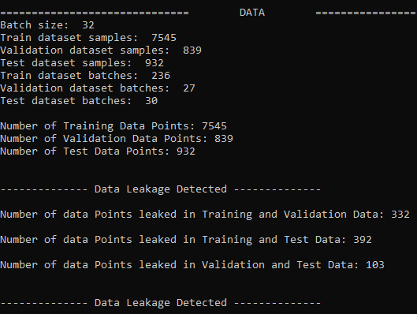

- When allowing leaked data into the train algorithm we get pretty good results

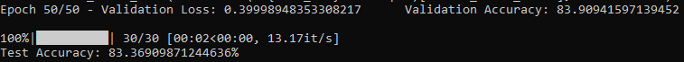

- When filtering out the leaked data we get the following results

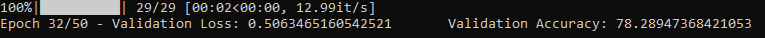

- I could repdroduce PeptideBERTs results with my Pipeline
  - Only difference with my algorithm, I use grad_norm_clipping to avoid exploding gradients
    
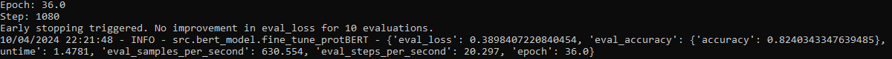

# Is this a Problem?

- I was curious about the minor impact of the data leakage on the results of the model, so I took a look into the predictions a bit more closely and found the Following:

- I printed out the labels of the Prediction Array each epoch for better tracking
  -  After the first epoch the model already predicts only 0. 

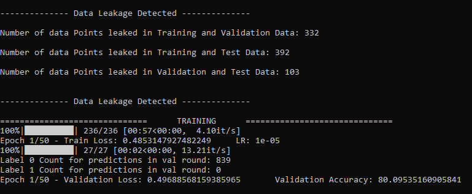

- ### Thats the data label distribution

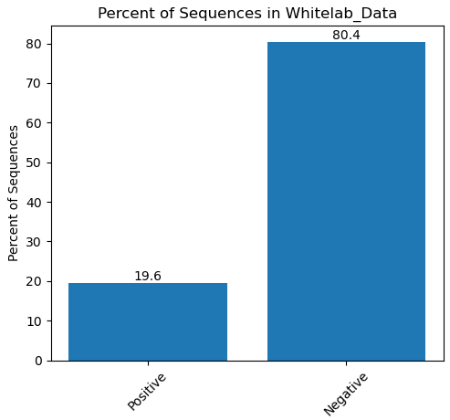

- by predicting only 0 it will naturally achieve 80% accuracy since 80% of the data is labeled 0

- Further in Training this will get pushed to the initial distribution of the labels of our data

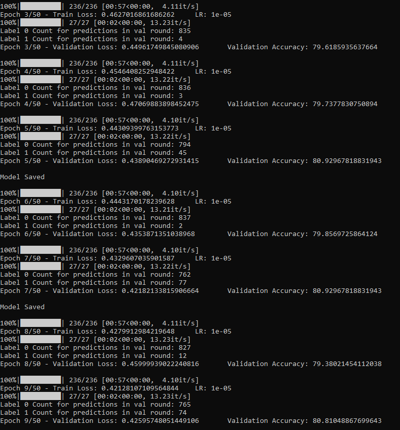

- also seen in my algorithm

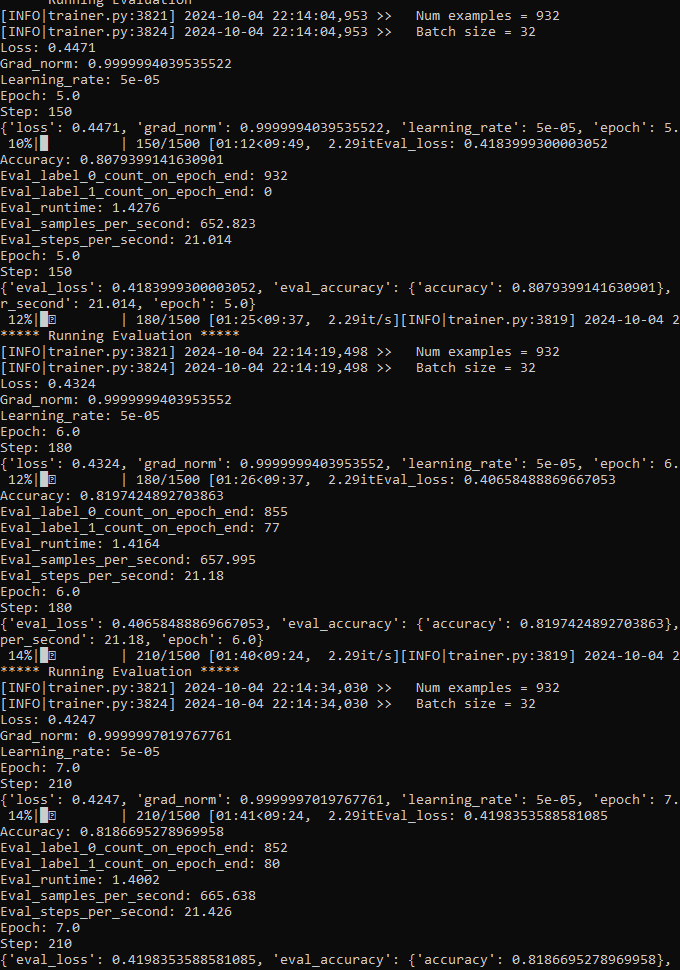

- it's the same when filtering out leaked data

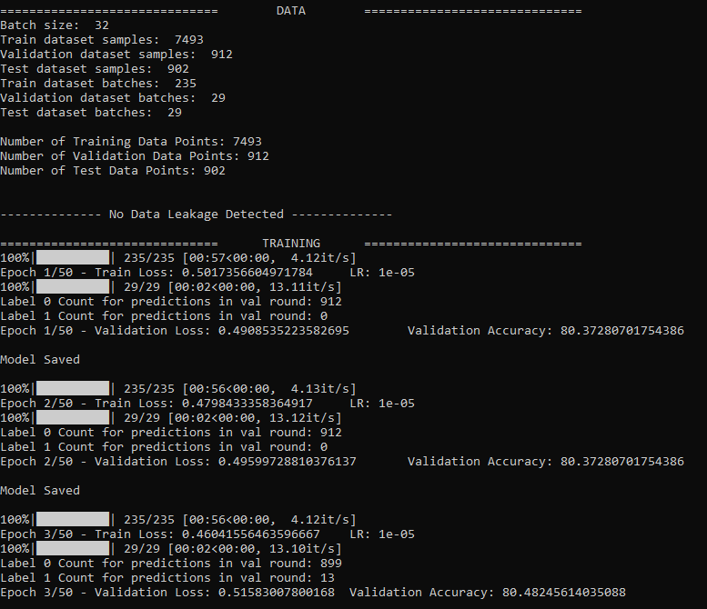

- here a visualization of the distribution of predicted labels per epoch
  - red is for label 1, positives
  - green is for label 0, negatives

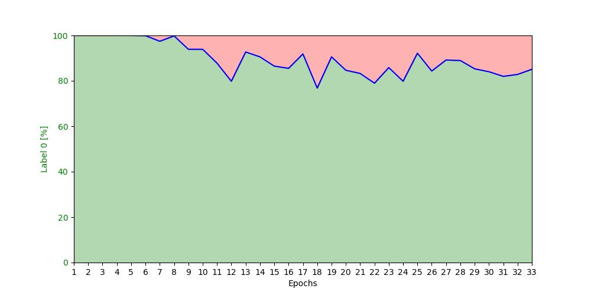

- I first thought this is wierd, given the fact we have a binary classifier I would assume a 50/50ish initialization of the label prediction
  - Dominik pointed out, The label distribution here is made on eval!
    - [ ] Make the same plot for each batch in train!. Should be doable in forward method I overwrote
    - [ ] I'm curious why the model predicts in the last epochs always the same relation of label 1 and 0

- Anyway, the test I made look good.
  - I used the Human Atlas Human Peptide Dataset for cleary non bioactive hemolytic Peptides
  - I used the hemolytic positiv data from our dataset for bioactive Peptides
    - The Idea, The human atlas data we should always see 0 since they are not hemolytic nor even bioactive, for our data we should see always 1 as prediction

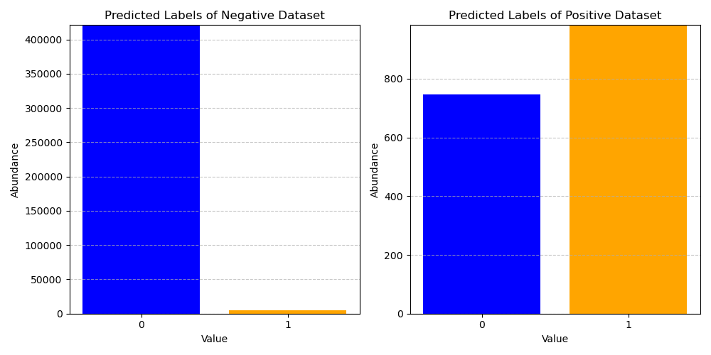

- surprisingly the model predicts 0 for nearly every data in the negative data set. the few label 1 prediction could be due to general inaccuracy
  - I expected 20% of the data to be predicted as label 1 if the model would've learned a distribution instead of a pattern in the sequences
- For the Positiv Data the model predicts quite 50/50 correct with a trend to label 1
  - I expected 20% of the data to be predicted as label 1 if the model would've learned a distribution instead of a pattern in the sequences

- It looks like the models learns a Pattern in the sequence and can generalize the Task.
  - [ ] Reassure with non leaked model!!! Since model knows much of the data already

### Cluster

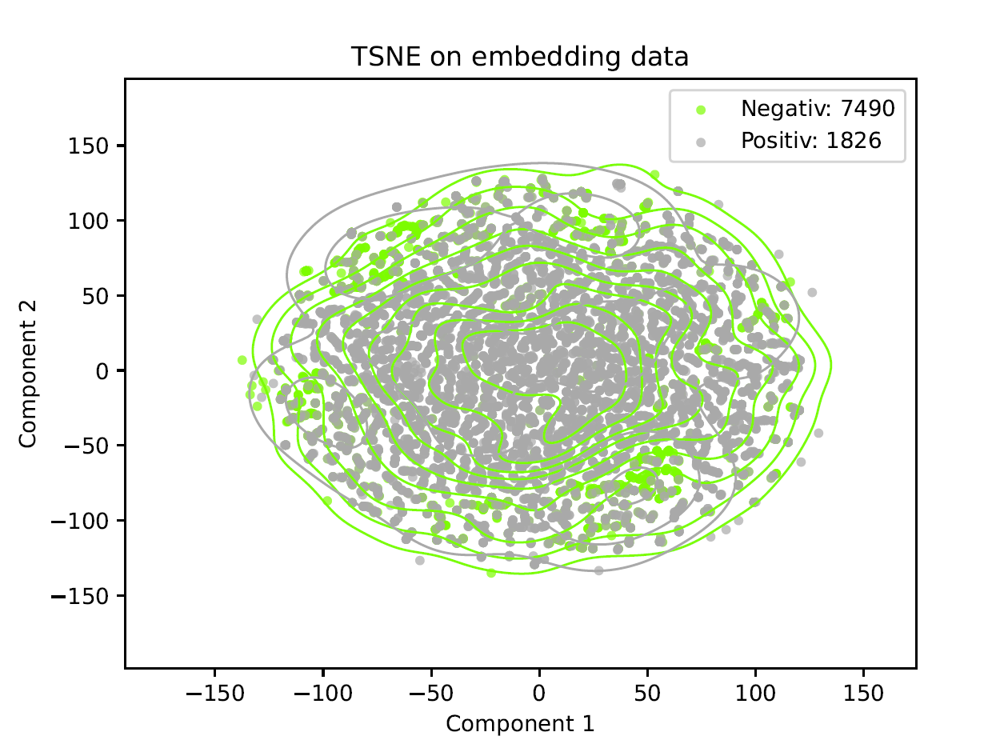

- No beatiful clusters here. I still don't know how Peptide Bert did their clustering. i tried a lot...
  - [ ] Wait for Email with response from PeptideBERT Authors

### PeptideBert with my Data and optimizations
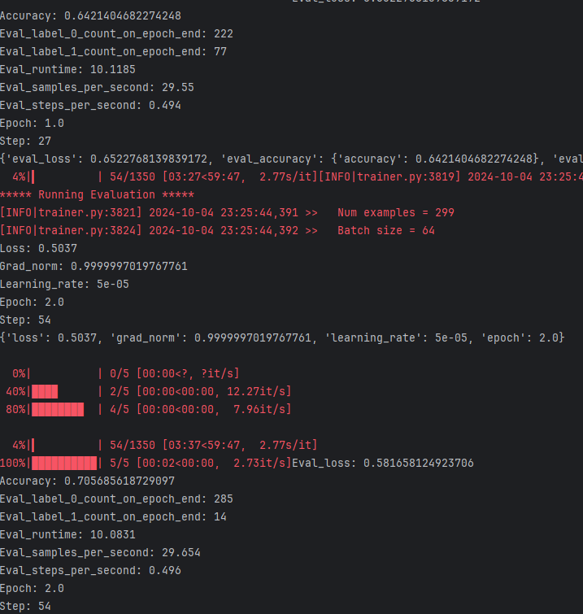
- First look on algorithm with my pipeline and my data
  - I could use some more datapoints. But first results looking good so far
  - Accuracy does not look that good so far, but could be number of eval points
  - BUT! The label prediction looks much healthier than with the original data

### Further analysis
- [ ] Implement their fisher test
  
*****************************************************
- to adress the distribution of labels in our train data I tried to implement a weighted sampler for the train data and eval data

- I could also use a weighted loss function

- [ ] Do I really need this????

********

## Proof of Concept
### Step 4 Proof of Concept: MLMPeptideBERT

- mlm task looks good so far. Naive Implementation of MLM Task with PeptideBERT provides stable results so far.
- Plotted is eval_accuracy, i didnt manage to capture train_accuracy so far. It's on TODO

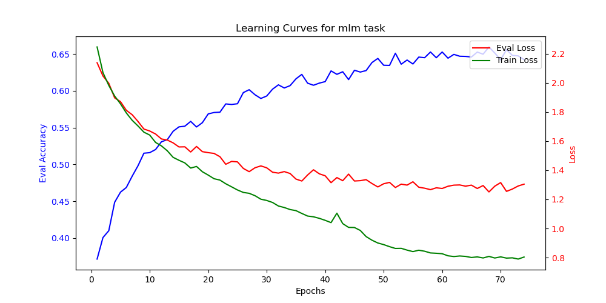
- Accuracy raise and loss decrease seems reasonable. I should not train longer than 20 epochs
- [ ] Also plot prediction distribution here. Could be interesting to see if the model is biased towards a certain amino acid
- [ ] Compareable results with PeptideBert Pipeline?
### Step 4.1 
- The accuracy for reconstructing masked bioactive sequences of protBERT should be the initial accuracy of our fine_tuning process

### Step 4.2 Curriculum Learning

- [ ] Implement Curriculum Learning for MLM Task

### Step 5 Proof of Concept: Binary PeptideBERT

- [ ] Still in Progress due to severe bug found in PeptideBERT train algorithm