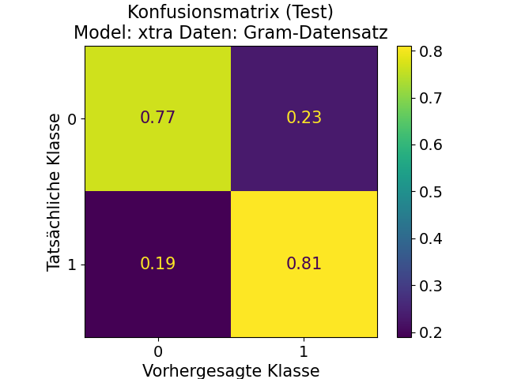
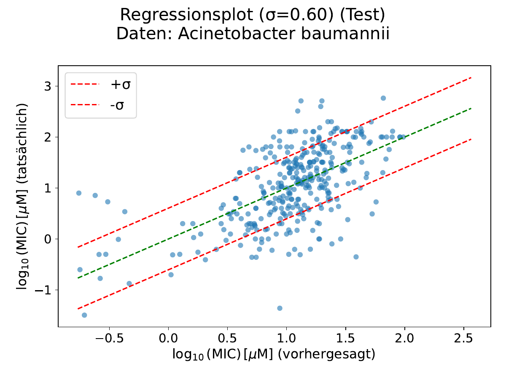

# Results

Results from the thesis, included for reference. The thesis configs/results were produced with
`python -m src ml_classify` / `python -m src ml_regress` and the corresponding BERT configs in
`src/bert_model/peptideBERT_configs/`, given the matching CSVs in `data/`. Re-running these
commands with the same data reproduces the numbers below.

Performance is solid but far from perfect, in line with the actual difficulty of the underlying biology.

  
  

Left: confusion matrix for Gram +/- classification on the test set (ExtraTrees, with features) -
~0.77/0.81 accuracy on the diagonal. Right: predicted vs. actual MIC values for *Acinetobacter
baumannii* on the test set (ExtraTrees, with features) - a clear trend, but with considerable spread.

### Hemolysis classification - sequence input only

| Dataset | Model | ACC Train | ACC Test | F1 Train | F1 Test | AUROC Train | AUROC Test | MCC Train | MCC Test |
|---|---|---|---|---|---|---|---|---|---|
| WhiteLab | xtra | 0.971 | 0.746 | 0.915 | 0.469 | 1.000 | 0.810 | 0.902 | 0.364 |
| WhiteLab | xgb | 0.999 | 0.868 | 0.996 | 0.429 | 1.000 | 0.807 | 0.996 | 0.396 |
| WhiteLab | rf | 0.934 | 0.734 | 0.823 | 0.471 | 0.999 | 0.819 | 0.803 | 0.371 |
| WhiteLab | svc | 0.921 | 0.776 | 0.708 | 0.396 | 0.930 | 0.792 | 0.670 | 0.340 |
| WhiteLab | bert | 0.900 | 0.806 | 0.721 | 0.494 | 0.927 | 0.804 | 0.673 | 0.389 |
| Threshold | xtra | 0.960 | 0.767 | 0.939 | 0.574 | 0.994 | 0.823 | 0.912 | 0.457 |
| Threshold | xgb | 0.999 | 0.780 | 0.998 | 0.645 | 1.000 | 0.825 | 0.998 | 0.495 |
| Threshold | rf | 0.973 | 0.746 | 0.962 | 0.682 | 0.999 | 0.831 | 0.943 | 0.491 |
| Threshold | svc | 0.829 | 0.746 | 0.742 | 0.632 | 0.909 | 0.804 | 0.615 | 0.441 |
| Threshold | bert | 0.841 | 0.723 | 0.830 | 0.711 | 0.911 | 0.795 | 0.667 | 0.441 |

### Hemolysis classification - sequence + biochemical features

| Dataset | Model | ACC Train | ACC Test | F1 Train | F1 Test | AUROC Train | AUROC Test | MCC Train | MCC Test |
|---|---|---|---|---|---|---|---|---|---|
| WhiteLab | xtra | 0.984 | 0.763 | 0.950 | 0.503 | 1.000 | 0.835 | 0.942 | 0.411 |
| WhiteLab | xgb | 1.000 | 0.873 | 0.999 | 0.467 | 1.000 | 0.834 | 0.999 | 0.431 |
| WhiteLab | rf | 0.960 | 0.758 | 0.884 | 0.500 | 1.000 | 0.850 | 0.868 | 0.409 |
| WhiteLab | svc | 0.925 | 0.780 | 0.723 | 0.404 | 0.943 | 0.825 | 0.689 | 0.352 |
| WhiteLab | bert | 0.879 | 0.804 | 0.645 | 0.453 | 0.887 | 0.782 | 0.577 | 0.340 |
| Threshold | xtra | 0.996 | 0.743 | 0.994 | 0.669 | 1.000 | 0.838 | 0.991 | 0.471 |
| Threshold | xgb | 1.000 | 0.781 | 0.999 | 0.655 | 1.000 | 0.839 | 0.999 | 0.501 |
| Threshold | rf | 0.997 | 0.736 | 0.996 | 0.664 | 1.000 | 0.831 | 0.993 | 0.461 |
| Threshold | svc | 0.848 | 0.735 | 0.774 | 0.629 | 0.919 | 0.819 | 0.659 | 0.440 |
| Threshold | bert | 0.770 | 0.690 | 0.756 | 0.677 | 0.834 | 0.760 | 0.523 | 0.373 |

`bert` refers to the fine-tuned PeptideBERT model, `xtra`/`xgb`/`rf`/`svc` to the classical ML baselines
(ExtraTrees, XGBoost, Random Forest, SVC).

### MIC regression - sequence input only

R² and MSE for train/test, per organism. **Bold** marks the best test R² and best test MSE per organism.

| Organism | Model | R² Train | R² Test | MSE Train | MSE Test |
|---|---|---|---|---|---|
| Acinetobacter baumannii | xtra | 0.989 | 0.324 | 0.006 | 0.376 |
| Acinetobacter baumannii | xgb | 0.988 | 0.362 | 0.007 | 0.355 |
| Acinetobacter baumannii | rf | 0.908 | 0.347 | 0.050 | 0.363 |
| Acinetobacter baumannii | svr | 0.594 | 0.345 | 0.223 | 0.364 |
| Acinetobacter baumannii | bert | 0.854 | **0.452** | 0.080 | **0.305** |
| Bacillus subtilis | xtra | 0.873 | 0.314 | 0.076 | 0.408 |
| Bacillus subtilis | xgb | 0.834 | 0.304 | 0.099 | 0.414 |
| Bacillus subtilis | rf | 0.905 | 0.299 | 0.057 | 0.417 |
| Bacillus subtilis | svr | 0.514 | 0.292 | 0.289 | 0.421 |
| Bacillus subtilis | bert | 0.689 | **0.318** | 0.185 | **0.406** |
| Candida albicans | xtra | 0.971 | 0.280 | 0.014 | 0.364 |
| Candida albicans | xgb | 0.521 | 0.243 | 0.226 | 0.382 |
| Candida albicans | rf | 0.893 | **0.294** | 0.050 | **0.357** |
| Candida albicans | svr | 0.300 | 0.181 | 0.330 | 0.414 |
| Candida albicans | bert | 0.558 | 0.222 | 0.209 | 0.393 |
| Enterobacter sp. | xtra | 0.886 | 0.302 | 0.050 | 0.314 |
| Enterobacter sp. | xgb | 0.851 | 0.200 | 0.066 | 0.359 |
| Enterobacter sp. | rf | 0.885 | 0.312 | 0.051 | 0.309 |
| Enterobacter sp. | svr | 0.821 | **0.383** | 0.078 | **0.277** |
| Enterobacter sp. | bert | 0.457 | 0.131 | 0.239 | 0.390 |
| Enterococcus faecalis | xtra | 0.970 | 0.253 | 0.015 | 0.427 |
| Enterococcus faecalis | xgb | 0.982 | **0.288** | 0.009 | **0.407** |
| Enterococcus faecalis | rf | 0.897 | 0.243 | 0.051 | 0.433 |
| Enterococcus faecalis | svr | 0.538 | 0.251 | 0.227 | 0.428 |
| Enterococcus faecalis | bert | 0.352 | 0.178 | 0.319 | 0.470 |
| Escherichia coli | xtra | 0.978 | 0.353 | 0.012 | 0.347 |
| Escherichia coli | xgb | 0.677 | 0.316 | 0.171 | 0.368 |
| Escherichia coli | rf | 0.902 | 0.332 | 0.052 | 0.359 |
| Escherichia coli | svr | 0.468 | 0.295 | 0.281 | 0.379 |
| Escherichia coli | bert | 0.906 | **0.396** | 0.050 | **0.325** |
| Klebsiella pneumoniae | xtra | 0.989 | 0.344 | 0.005 | 0.304 |
| Klebsiella pneumoniae | xgb | 0.617 | 0.255 | 0.181 | 0.345 |
| Klebsiella pneumoniae | rf | 0.905 | 0.299 | 0.045 | 0.324 |
| Klebsiella pneumoniae | svr | 0.551 | 0.248 | 0.213 | 0.348 |
| Klebsiella pneumoniae | bert | 0.821 | **0.363** | 0.085 | **0.295** |
| Micrococcus luteus | xtra | 0.877 | 0.135 | 0.084 | 0.555 |
| Micrococcus luteus | xgb | 0.648 | 0.179 | 0.241 | 0.526 |
| Micrococcus luteus | rf | 0.899 | 0.143 | 0.069 | 0.549 |
| Micrococcus luteus | svr | 0.587 | **0.194** | 0.283 | **0.517** |
| Micrococcus luteus | bert | 0.657 | 0.094 | 0.235 | 0.581 |
| Pseudomonas aeruginosa | xtra | 0.984 | 0.366 | 0.008 | 0.300 |
| Pseudomonas aeruginosa | xgb | 0.826 | 0.340 | 0.088 | 0.312 |
| Pseudomonas aeruginosa | rf | 0.907 | 0.351 | 0.047 | 0.307 |
| Pseudomonas aeruginosa | svr | 0.484 | 0.289 | 0.260 | 0.336 |
| Pseudomonas aeruginosa | bert | 0.984 | **0.452** | 0.008 | **0.259** |
| Salmonella enterica | xtra | 0.863 | 0.346 | 0.076 | 0.335 |
| Salmonella enterica | xgb | 0.535 | 0.215 | 0.259 | 0.402 |
| Salmonella enterica | rf | 0.896 | 0.352 | 0.058 | 0.332 |
| Salmonella enterica | svr | 0.513 | 0.322 | 0.272 | 0.347 |
| Salmonella enterica | bert | 0.859 | **0.401** | 0.079 | **0.307** |
| Staphylococcus aureus | xtra | 0.854 | 0.257 | 0.069 | 0.340 |
| Staphylococcus aureus | xgb | 0.820 | 0.254 | 0.085 | 0.341 |
| Staphylococcus aureus | rf | 0.888 | 0.264 | 0.053 | 0.337 |
| Staphylococcus aureus | svr | 0.379 | 0.208 | 0.292 | 0.363 |
| Staphylococcus aureus | bert | 0.919 | **0.336** | 0.038 | **0.304** |
| Staphylococcus epidermidis | xtra | 0.975 | **0.272** | 0.012 | **0.366** |
| Staphylococcus epidermidis | xgb | 0.844 | 0.253 | 0.077 | 0.376 |
| Staphylococcus epidermidis | rf | 0.885 | 0.245 | 0.057 | 0.380 |
| Staphylococcus epidermidis | svr | 0.498 | 0.230 | 0.247 | 0.388 |
| Staphylococcus epidermidis | bert | 0.675 | 0.271 | 0.160 | 0.367 |

### MIC regression - sequence + biochemical features

| Organism | Model | R² Train | R² Test | MSE Train | MSE Test |
|---|---|---|---|---|---|
| Acinetobacter baumannii | xtra | 0.999 | 0.417 | 0.001 | 0.324 |
| Acinetobacter baumannii | xgb | 0.904 | 0.383 | 0.053 | 0.343 |
| Acinetobacter baumannii | rf | 0.913 | 0.344 | 0.048 | 0.365 |
| Acinetobacter baumannii | svr | 0.624 | 0.386 | 0.206 | 0.341 |
| Acinetobacter baumannii | bert | 0.907 | **0.477** | 0.051 | **0.291** |
| Bacillus subtilis | xtra | 0.999 | **0.380** | 0.000 | **0.369** |
| Bacillus subtilis | xgb | 0.924 | 0.345 | 0.045 | 0.390 |
| Bacillus subtilis | rf | 0.912 | 0.342 | 0.052 | 0.392 |
| Bacillus subtilis | svr | 0.658 | 0.309 | 0.203 | 0.411 |
| Bacillus subtilis | bert | 0.726 | 0.320 | 0.163 | 0.405 |
| Candida albicans | xtra | 0.980 | **0.374** | 0.009 | **0.316** |
| Candida albicans | xgb | 0.958 | 0.356 | 0.020 | 0.325 |
| Candida albicans | rf | 0.903 | 0.345 | 0.046 | 0.331 |
| Candida albicans | svr | 0.324 | 0.210 | 0.319 | 0.399 |
| Candida albicans | bert | 0.861 | 0.327 | 0.066 | 0.340 |
| Enterobacter sp. | xtra | 0.976 | **0.390** | 0.011 | **0.274** |
| Enterobacter sp. | xgb | 0.403 | 0.145 | 0.262 | 0.384 |
| Enterobacter sp. | rf | 0.888 | 0.265 | 0.049 | 0.330 |
| Enterobacter sp. | svr | 0.802 | 0.360 | 0.087 | 0.288 |
| Enterobacter sp. | bert | 0.343 | 0.048 | 0.289 | 0.428 |
| Enterococcus faecalis | xtra | 0.994 | **0.293** | 0.003 | **0.404** |
| Enterococcus faecalis | xgb | 0.880 | 0.284 | 0.059 | 0.410 |
| Enterococcus faecalis | rf | 0.902 | 0.288 | 0.048 | 0.407 |
| Enterococcus faecalis | svr | 0.567 | 0.241 | 0.213 | 0.434 |
| Enterococcus faecalis | bert | 0.811 | 0.240 | 0.093 | 0.435 |
| Escherichia coli | xtra | 0.991 | **0.413** | 0.005 | **0.315** |
| Escherichia coli | xgb | 0.788 | 0.386 | 0.112 | 0.330 |
| Escherichia coli | rf | 0.908 | 0.390 | 0.049 | 0.328 |
| Escherichia coli | svr | 0.508 | 0.338 | 0.260 | 0.355 |
| Escherichia coli | bert | 0.945 | 0.374 | 0.029 | 0.336 |
| Klebsiella pneumoniae | xtra | 0.998 | **0.373** | 0.001 | **0.290** |
| Klebsiella pneumoniae | xgb | 0.800 | 0.358 | 0.095 | 0.297 |
| Klebsiella pneumoniae | rf | 0.915 | 0.355 | 0.040 | 0.298 |
| Klebsiella pneumoniae | svr | 0.582 | 0.274 | 0.198 | 0.336 |
| Klebsiella pneumoniae | bert | 0.755 | 0.282 | 0.116 | 0.332 |
| Micrococcus luteus | xtra | 0.908 | **0.236** | 0.063 | **0.490** |
| Micrococcus luteus | xgb | 0.983 | 0.220 | 0.012 | 0.500 |
| Micrococcus luteus | rf | 0.902 | 0.166 | 0.067 | 0.535 |
| Micrococcus luteus | svr | 0.723 | 0.189 | 0.190 | 0.520 |
| Micrococcus luteus | bert | 0.673 | 0.137 | 0.224 | 0.554 |
| Pseudomonas aeruginosa | xtra | 0.972 | **0.455** | 0.014 | **0.258** |
| Pseudomonas aeruginosa | xgb | 0.899 | 0.431 | 0.051 | 0.269 |
| Pseudomonas aeruginosa | rf | 0.912 | 0.416 | 0.045 | 0.276 |
| Pseudomonas aeruginosa | svr | 0.527 | 0.348 | 0.238 | 0.308 |
| Pseudomonas aeruginosa | bert | 0.936 | 0.436 | 0.032 | 0.267 |
| Salmonella enterica | xtra | 0.983 | **0.386** | 0.010 | **0.314** |
| Salmonella enterica | xgb | 0.789 | 0.326 | 0.118 | 0.345 |
| Salmonella enterica | rf | 0.899 | 0.377 | 0.056 | 0.319 |
| Salmonella enterica | svr | 0.537 | 0.354 | 0.258 | 0.331 |
| Salmonella enterica | bert | 0.588 | 0.285 | 0.230 | 0.366 |
| Staphylococcus aureus | xtra | 0.986 | **0.314** | 0.007 | **0.314** |
| Staphylococcus aureus | xgb | 0.835 | 0.311 | 0.078 | 0.315 |
| Staphylococcus aureus | rf | 0.894 | 0.302 | 0.050 | 0.319 |
| Staphylococcus aureus | svr | 0.442 | 0.245 | 0.262 | 0.346 |
| Staphylococcus aureus | bert | 0.761 | 0.260 | 0.112 | 0.338 |
| Staphylococcus epidermidis | xtra | 0.993 | **0.329** | 0.003 | **0.338** |
| Staphylococcus epidermidis | xgb | 0.767 | 0.275 | 0.115 | 0.365 |
| Staphylococcus epidermidis | rf | 0.900 | 0.306 | 0.049 | 0.349 |
| Staphylococcus epidermidis | svr | 0.550 | 0.243 | 0.222 | 0.381 |
| Staphylococcus epidermidis | bert | 0.884 | 0.310 | 0.057 | 0.347 |

### MIC regression - cluster-based (similarity-aware) split, sequence input only

The tables above use a random split at the sequence level (each unique peptide goes into exactly one
split). That still lets near-duplicate peptides, for example a single point mutation, land on opposite
sides of the split. The cluster split groups sequences into similarity clusters with MMseqs2
(`min-seq-id 0.5`, `coverage 0.8`) and keeps whole clusters in one split, so the test set holds
sequences dissimilar to those seen in training
(`src/data_preprocessing/cluster_data_splitter.py`, CLI `cluster_init`).

Fine-tuned BERT, sequence input only. **Work in progress:** 9 of 12 organisms are filled in below, the
remaining organisms and the classical ML baselines are still to be added.

| Organism | Model | R² Train | R² Test | MSE Train | MSE Test |
|---|---|---|---|---|---|
| Acinetobacter baumannii | bert | 0.739 | 0.208 | 0.144 | 0.506 |
| Bacillus subtilis | bert | 0.565 | 0.246 | 0.240 | 0.512 |
| Candida albicans | bert | 0.138 | 0.113 | 0.408 | 0.446 |
| Enterobacter sp. | bert | 0.418 | 0.143 | 0.238 | 0.375 |
| Enterococcus faecalis | bert | _pending_ | _pending_ | _pending_ | _pending_ |
| Escherichia coli | bert | 0.346 | 0.274 | 0.344 | 0.395 |
| Klebsiella pneumoniae | bert | 0.285 | 0.233 | 0.336 | 0.365 |
| Micrococcus luteus | bert | 0.573 | 0.066 | 0.282 | 0.602 |
| Pseudomonas aeruginosa | bert | 0.798 | 0.228 | 0.104 | 0.369 |
| Salmonella enterica | bert | _pending_ | _pending_ | _pending_ | _pending_ |
| Staphylococcus aureus | bert | 0.364 | 0.177 | 0.298 | 0.383 |
| Staphylococcus epidermidis | bert | _pending_ | _pending_ | _pending_ | _pending_ |

Compared to the random split (same BERT, sequence input only), test R² drops for almost every organism:

| Organism | R² Test (random) | R² Test (cluster) | Change |
|---|---|---|---|
| Acinetobacter baumannii | 0.452 | 0.208 | -0.244 |
| Bacillus subtilis | 0.318 | 0.246 | -0.072 |
| Candida albicans | 0.222 | 0.113 | -0.109 |
| Enterobacter sp. | 0.131 | 0.143 | +0.012 |
| Escherichia coli | 0.396 | 0.274 | -0.122 |
| Klebsiella pneumoniae | 0.363 | 0.233 | -0.130 |
| Micrococcus luteus | 0.094 | 0.066 | -0.028 |
| Pseudomonas aeruginosa | 0.452 | 0.228 | -0.224 |
| Staphylococcus aureus | 0.336 | 0.177 | -0.159 |

The consistent drop means part of the random-split test score came from near-duplicate sequences shared
across splits, not from generalization to new sequence space. Enterobacter is the exception, and it also
has the smallest training set, where a random split has little near-duplicate structure to exploit. This
sits on top of the measurement-noise ceiling shown in `notebooks/data_quality_mic.ipynb`: the
random-split R² is already capped by label noise, and the similarity-aware split shows how much of what
remains is similarity-driven rather than genuine generalization.
