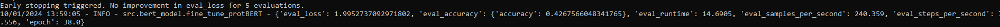
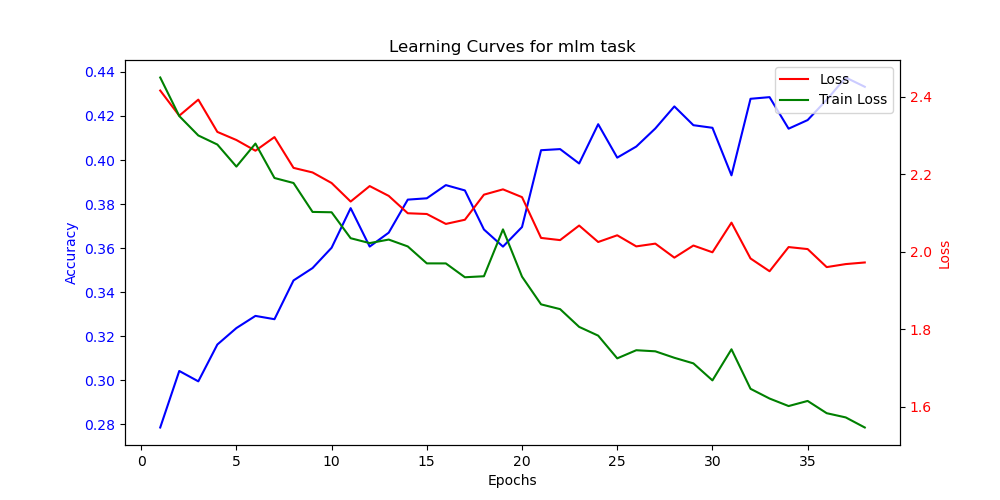

## First Documentation of Results with my Pipeline

### Reproduce PeptideBERT Results

- Here i tried to reproduce the Results from the PeptideBERT Paper. I used the same Data and the same Hyperparameters as in the Paper. 
- I Still need to tweek the MLM train with stuff like Curriculum Learning. There is still lot of optimization to do.

- [ ] **Step 1:** Show Results of PeptideBERT Train with normal whitelab data
  - [ ] **Step 1.1:** Show ablation Test Results
  - [ ] **Step 1.2:** TODO Cluster with model
- [ ] **Step 2:** Show Results of PeptideBERT Train without Data Leakage
- [ ] **Step 3:** Show Results of PeptideBERT Train with our Data and w/o Leakage
  - [ ] **Step 3.1:** TODO Cluster with model
- [ ] **Step 4:** Show Results of MLMPeptideBERT and compare to protBERT
  - [ ] **Step 4.1:** Initial Accuracy of mlm task train should be accuracy of protBERT for our peptide Task
-[ ] **Step 5:** Retrain binary PeptideBERT on our new MLMBERT
  - [ ] **Step 5.1:** TODO Cluster with model

## Proof of Concept
### Step 4 Proof of Concept: MLMPeptideBERT

### Step 5 Proof of Concept: Binary PeptideBERT