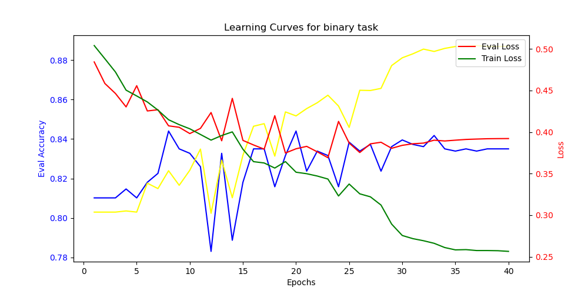
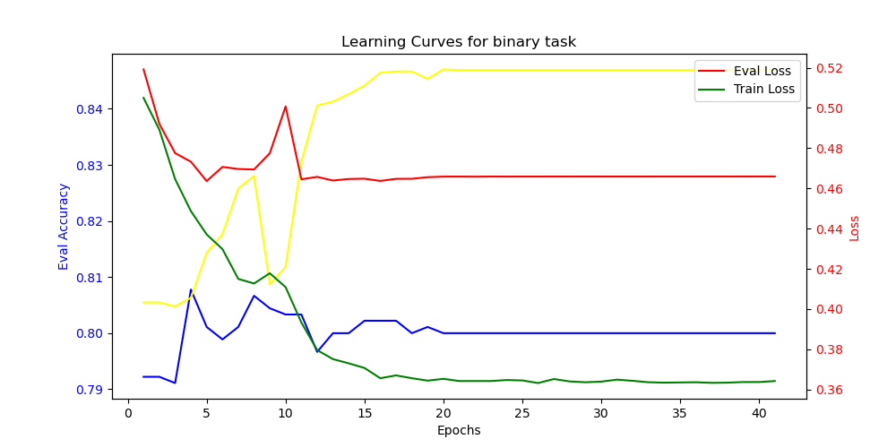
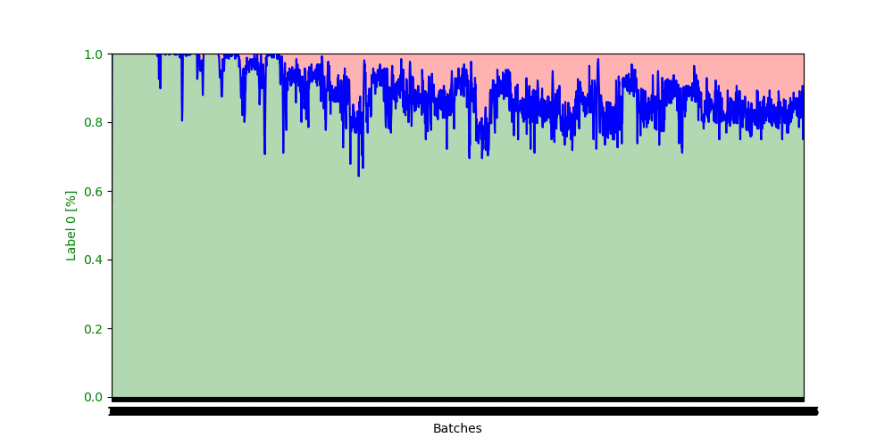
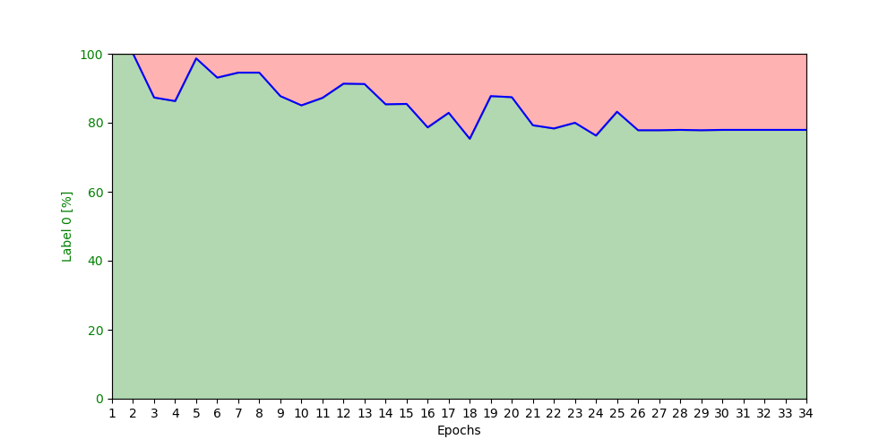
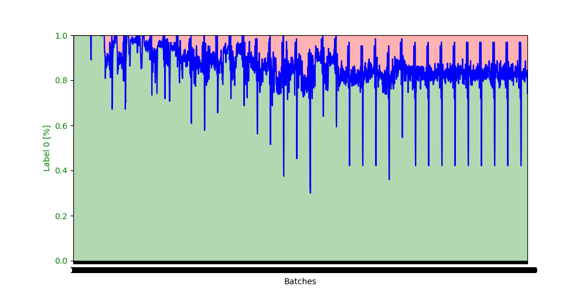
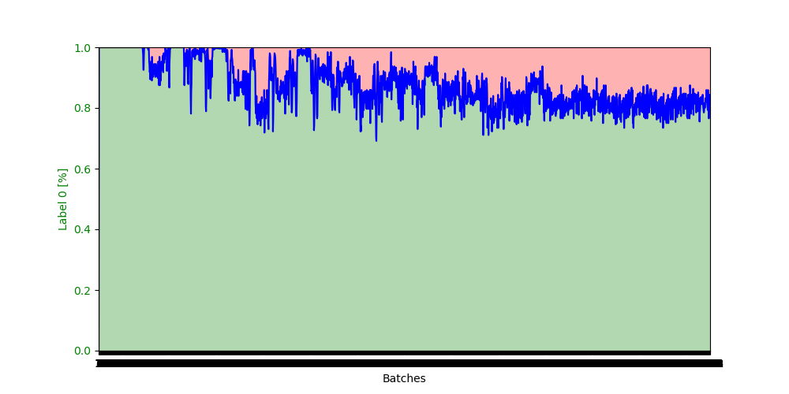
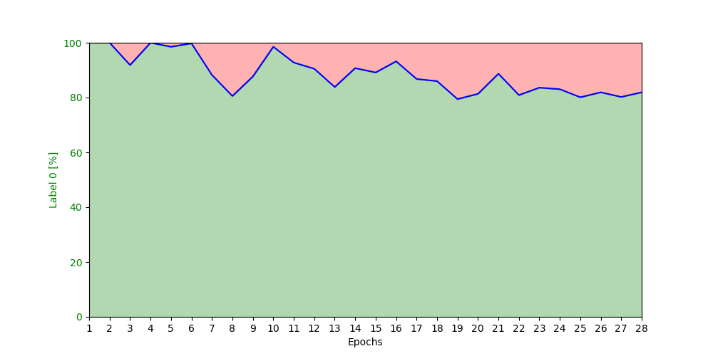

## First Documentation of Results with my Pipeline

### Planned steps for this Project

- Here i tried to reproduce the Results from the PeptideBERT Paper. I used the same Data and the same Hyperparameters as in the Paper. 
- I Still need to tweek the MLM train with stuff like Curriculum Learning. There is still lot of optimization to do.

- [x] **Step 1:** Show Results of PeptideBERT Train with normal whitelab data
  - [x] **Step 1.1:** Show ablation Test Results
  - [ ] **Step 1.2:** TODO Cluster with model
- [x] **Step 2:** Show Results of PeptideBERT Train without Data Leakage
- [x] **Step 3:** Show Results of PeptideBERT Train with our Data and w/o Leakage
  - [ ] **Step 3.1:** TODO Cluster with model
- [ ] **Step 4:** Show Results of MLMPeptideBERT and compare to protBERT
  - [ ] **Step 4.1:** Initial Accuracy of mlm task train should be accuracy of protBERT for our peptide Task
  - [ ] **Step 4.2:** Show Results with Curriculum Learning
-[ ] **Step 5:** Retrain binary PeptideBERT on our new MLMBERT
  - [ ] **Step 5.1:** TODO Cluster with model

### Step 1 - 3:
- Due to data leakage I couldn't follow the task for reproducing peptideBERTs results.
- I now try to show the effects of the Data Leakage on the model and the results

### Train run for PeptideBERT on original Algorithm but with my data_leakage_viewer
- This Function searches for leaked data in the train, val and test datasets

- When allowing leaked data into the train algorithm we get pretty good results

- When filtering out the leaked data we get the following results

- I could repdroduce PeptideBERTs results with my Pipeline
  - Only difference with my algorithm, I use grad_norm_clipping to avoid exploding gradients
  

#### Learning Curves generated through my algorithm

- The Learning Curve for the leaked variant of PeptideBERT

- The Learning Curve for the non leaked variant of PeptideBERT

# Is this a Problem?

- I was curious about the minor impact of the data leakage on the results of the model, so I took a look into the predictions a bit more closely and found the Following:

- I printed out the labels of the Prediction Array each epoch for better tracking
  -  After the first epoch the model already predicts only 0. 

- ### Thats the data label distribution

- by predicting only 0 it will naturally achieve 80% accuracy since 80% of the data is labeled 0

- I plotted the distribution of predicted labels for each batch in training and evaluation
  - Area painted red representing the total of predicted 1 labels
  - Area painted green representing the total of predicted 0 labels
  
### These are the results for the leakage variant of PeptideBERT
    
  

  - Label Prediction for Epochs

  - Label Prediction for Train batches

### These are the results for the non leakage variant of PeptideBERT

  - Label Prediction for Epochs

  - Label Prediction for Train batches

#### Testing this further
- Anyway, the test I made looked good.
  - I used the Human Atlas Human Peptide Dataset for cleary non bioactive hemolytic Peptides
  - I used the hemolytic positiv data from our dataset for bioactive Peptides
    - The Idea, The human atlas data we should always see 0 since they are not hemolytic nor even bioactive, for our data we should see always 1 as prediction

### Cluster

- [ ] Add cluster Graphs

#### Leaked Variant

- [ ] Add Plots

#### Non Leaked 

- [ ] Add Plots

## Proof of Concept
### Step 4 Proof of Concept: MLMPeptideBERT

- mlm task looks good so far. Naive Implementation of MLM Task with PeptideBERT provides stable results so far.
- Plotted is eval_accuracy, I didn't manage to capture train_accuracy so far. It's on TODO

- Accuracy raise and loss decrease seems reasonable. 
- [ ] Also plot prediction distribution here. Could be interesting to see if the model is biased towards a certain amino acid

### Step 4.1 
- The accuracy for reconstructing masked bioactive sequences of protBERT should be the initial accuracy of our fine_tuning process

### Step 4.2 Curriculum Learning

- [ ] Implement Curriculum Learning for MLM Task

### Step 5 Proof of Concept: Binary PeptideBERT

- [ ] Still in Progress due to severe bug found in PeptideBERT train algorithm

### Look into Label predictions

#### With Data Leakage

- Batch Wise

- Epoch Wise
