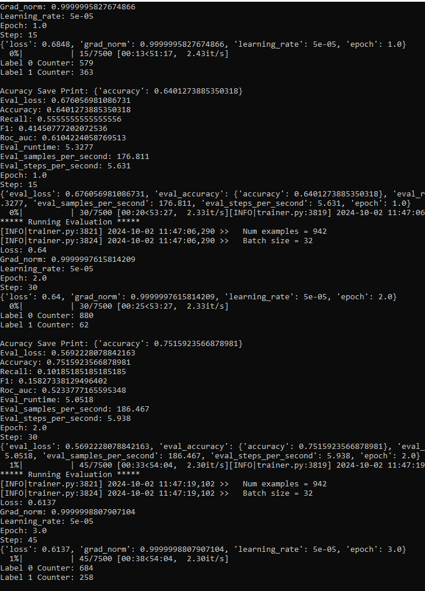
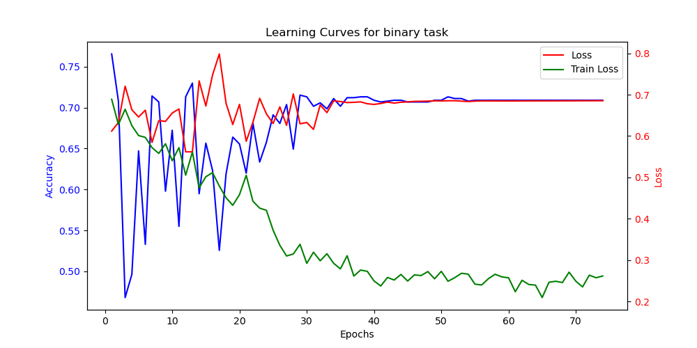
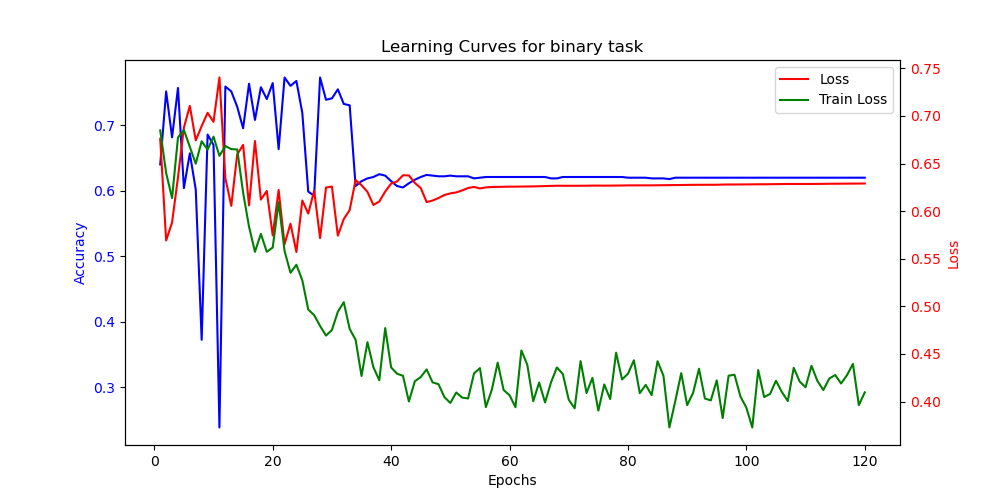

## Here i try to document my results

- While reproducing the results of PeptideBERT i found some interesting data leakage in the dataset

### Train run for PeptideBERT on original Algorithm but with my data_leakage_viewer
- This Function searches for leaked data in the train, val and test datasets

- When allowing leaked data into the train algorithm we get pretty good results

- When filtering out the leaked data we get the following results

- I could repdroduce PeptideBERTs results with my Pipeline
    

# The Bigger Real Big Problem

- I was curious about the minor impact of the data leakage on the results of the model, so I took a look into the predictions a bit more closely and found the Following:

- I printed out the labels of the Prediction Array each epoch for better tracking
  -  After the first epoch the model already predicts only 0. 

- ### Thats the data label distribution

- by predicting only 0 it will naturally achieve 80% accuracy since 80% of the data is labeled 0

- Further in Training the bias will get pushed to the initial distribution of the labels of our data, since we're comparing the loss with our ground truth

- it's the same when filtering out leaked data

- To avoid training with fewer data points I first tried a RandomWeightedSampler by applying label weights

- The Random Sampler kindah seems to fix the predictions in the first epoch, but it jumps wildly
  - May that's due to the class imbalance in the dataset. We sampling train but presenting an imbalanced eval set

- That's also indicated here sinc eval loss and eval accuracy seems to be pushed to a fixed output but train loss is fluctuating and seems shrinking normaly

- and a second run with higher early stop params

- The data always seems to fall to a fixed distribution of labels. This indicates that the model is learning a distribution not a pattern in the sequence

- [ ] Apply RandomSampler also to Eval dataset!!!